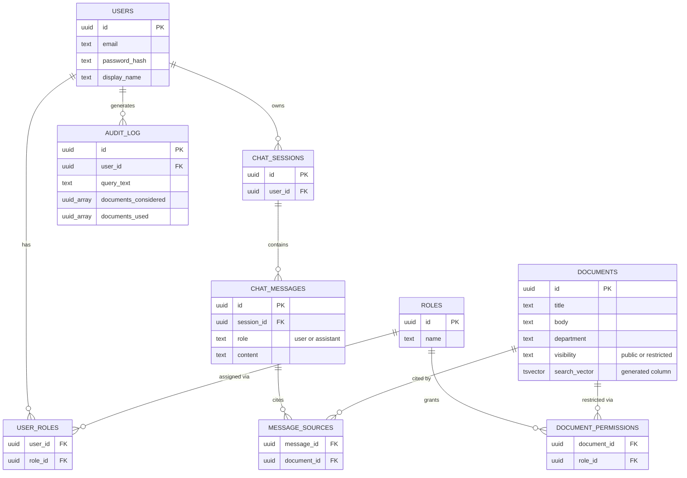

# Role-Based Enterprise Knowledge Assistant

A small full-stack app where authenticated users chat with a synthetic internal knowledge base and
only ever see answers and sources drawn from documents they're permitted to access. Access control
is enforced by the backend's SQL query layer — never by asking the LLM to keep a secret.

For the deeper design rationale, tradeoffs, known limitations, and security-testing writeup, see
[NOTES.md](NOTES.md).

## Stack

- **Backend**: Node, Express, TypeScript
- **Database**: PostgreSQL (full-text search via `tsvector`/`ts_rank`, not embeddings — see NOTES.md)
- **Frontend**: React, Vite, TypeScript
- **LLM**: OpenRouter (`openai/gpt-4o-mini`), used only for final answer synthesis over an
  already permission-filtered context

## Setup

**Prerequisites**: Node 22+, Docker Desktop, an OpenRouter API key.

**1. Start Postgres**

```bash
docker compose up -d
```

**2. Start the API server**

```bash
cd server
cp .env.example .env   # then paste your OPENROUTER_API_KEY into .env
npm install
npm run migrate         # applies the schema
npm run seed             # creates the demo users, roles, and documents
npm run dev               # listens on http://localhost:3000
```

**3. Start the frontend** (separate terminal)

```bash
cd client
cp .env.example .env
npm install
npm run dev   # opens on http://localhost:5173
```

Open the printed Vite URL and log in with any of the seeded users below.

## Architecture overview

```
┌──────────────┐        ┌──────────────────────────────┐        ┌───────────────┐
│   Frontend   │───────▶│        Express API           │───────▶│  PostgreSQL   │
│ React + Vite │◀───────│   /auth   /chat   /admin     │◀───────│ users, roles, │
└──────────────┘        │                              │        │ documents,    │
                        │  Retrieval (per question):   │        │ permissions,  │
                        │  1. permission filter (SQL)  │        │ sessions,     │
                        │  2. full-text rank on the    │        │ messages,     │
                        │     already-filtered set     │        │ audit_log     │
                        │  3. build LLM context        │        └───────────────┘
                        └──────────────┬───────────────┘
                                       │ only permitted, matched documents
                                       ▼
                                ┌───────────────┐
                                │  OpenRouter   │
                                │(LLM synthesis)│
                                └───────────────┘
```

**The one rule the whole design hangs on**: permission filtering happens in the SQL `WHERE` clause
that selects candidate documents — before anything is ranked, formatted, or sent to the LLM. See
`findPermittedDocuments` in [`server/src/routes/chat.ts`](server/src/routes/chat.ts): a document a
user isn't permitted to see is never fetched from the database, so it's structurally impossible for
it to reach the LLM's context, regardless of how the question is phrased. This was verified directly
with SQL injection, prompt injection, forged-JWT, and IDOR attempts — see [NOTES.md](NOTES.md).

### Database schema

Full DDL in [`server/src/db/schema.sql`](server/src/db/schema.sql):



- `users`, `roles`, `user_roles` — identity and role assignment, deliberately separate concerns (see
  "Why this shape" below)
- `documents` — title, body, department, `visibility` (`public` skips permission checks entirely),
  and a generated `tsvector` column for search
- `document_permissions` — which roles can see a given restricted document (public documents have
  no rows here; a restricted document with zero permission rows is invisible to everyone — fail-closed)
- `chat_sessions`, `chat_messages`, `message_sources` — conversation history and, for each assistant
  reply, exactly which documents backed it
- `audit_log` — every retrieval attempt, recording both the documents considered (post-permission-filter
  candidates) and the documents actually used (sent to the LLM), even when the answer was a refusal

**Why this shape**: identity (`users`) and permissions (`roles`/`user_roles`/`document_permissions`)
are intentionally separate tables rather than, say, a `users.department` column — a user's identity
never changes, but what they're allowed to see is a many-to-many relationship (Carol has two roles;
a role can gate many documents). This is also what makes the identity/permissions distinction real in
code, not just in schema: `server/src/auth/token.ts` resolves `user_roles` once at login and bakes
role IDs into the JWT, and every downstream permission check (`findPermittedDocuments` in
`server/src/routes/chat.ts`) reads only those verified role IDs — never the user's identity claim
directly, and never anything from request input. Full rationale for the rest of the schema's shape
(why `message_sources` is its own join table, why `audit_log` uses arrays instead of a join table) is
in [NOTES.md](NOTES.md).

### API

| Method | Path | Auth | Purpose |
|---|---|---|---|
| POST | `/auth/login` | — | email + password → JWT (roles baked in at login) |
| GET | `/auth/me` | required | current identity + roles |
| POST | `/chat/sessions` | required | create a new chat session |
| POST | `/chat/sessions/:id/messages` | required | ask a question, get an answer + sources back |
| GET | `/chat/sessions/:id/messages` | required | session history |
| GET | `/admin/audit-log` | required (any authenticated user, demo convenience) | every retrieval record, for verifying enforcement without a DB client |

## Seeded users

All demo accounts use the password `demo1234`.

| Email | Roles | Can see |
|---|---|---|
| `alice@emotech-demo.test` | finance | public docs + finance docs |
| `bob@emotech-demo.test` | hr | public docs + HR docs |
| `carol@emotech-demo.test` | procurement, operations | public docs + procurement + operations docs |
| `dave@emotech-demo.test` | *(none)* | public docs only |

## Demo scenarios

These map to the four required scenarios — try them in the chat UI, then check `/admin/audit-log`
(or the Audit log tab) to see exactly what each query considered and used.

1. **Authorized hit** — as Alice, ask *"What is the expense approval threshold?"* → answer cites the
   Q3 Expense Approval Policy (finance).
2. **Same question, different user** — as Dave, ask the identical question → *"I don't have
   authorized information to answer that question."* No finance content is referenced anywhere in
   the response or its sources.
3. **Generally available document** — as Dave, ask *"Where are the office locations?"* → answered
   from the public Office Locations & Contacts document. Works for any user.
4. **Restricted attempt** — as Bob (HR only), ask *"What are the approved supplier criteria?"* → no
   procurement content surfaces, even though the document exists and the topic is one the LLM could
   plausibly discuss from general knowledge.

More example questions per user, plus adversarial/security test cases, are in [NOTES.md](NOTES.md).
